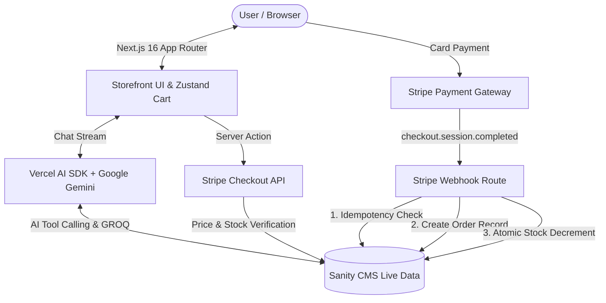

# 🛒 SmartCommerce AI — Autonomous E-Commerce Platform

<div align="center">


<br />

**A state-of-the-art, full-stack E-Commerce ecosystem powered by Next.js 16, React 19, Sanity Live CMS, Stripe Payments, Clerk Auth, and an autonomous AI Shopping Copilot built with Vercel AI SDK & Google Gemini.**

[Features](#-key-features) • [Architecture](#-architecture--data-flow) • [Tech Stack](#-tech-stack) • [Getting Started](#-getting-started) • [Stripe Testing](#-testing-payments-with-stripe) • [Project Structure](#-project-structure)

</div>

---

## 🌟 Overview

**SmartCommerce AI** represents a next-generation shopping experience that bridges conversational AI with high-performance headless commerce. Customers can browse curated catalog collections, dynamically filter products, manage a persistent shopping cart, and interact with an **intelligent AI shopping agent** that searches real-time inventory, recommends matching items, and tracks active orders via conversational natural language.

Built with a **zero-trust security architecture**, every payment transaction validates live prices and inventory server-side against Sanity CMS before creating Stripe sessions, while post-payment stock decrements are safely managed through atomic transactions inside idempotent webhook handlers.

---

## ✨ Key Features

### 🤖 Autonomous AI Shopping Assistant (Copilot)
* **Natural Language Discovery**: Chat naturally with the AI assistant to find products tailored to specific preferences, price limits, materials, and colors.
* **Structured Tool Calling**: Utilizes `@ai-sdk/google` (`gemini-2.5-flash`) and `ToolLoopAgent` with strict **Zod** validation to execute custom GROQ search queries dynamically.
* **Context-Aware Order Inquiries**: Authenticated users can query their order status (*"Where is my last shipment?"*), and the agent securely retrieves real-time fulfillment updates.
* **Interactive Chat Widgets**: Renders rich UI components (interactive product cards, order status badges, action links) directly inside the streaming chat interface.

### 🛍️ Dynamic Storefront & Catalog
* **Sanity Live Content API**: Real-time content streaming using `defineLive` — updates made in the CMS reflect instantaneously on the storefront without rebuilds or page refreshes.
* **Multi-Faceted Search & Filters**: Search products with instantaneous filtering across categories, materials (wood, metal, fabric, leather, glass), colors, and price range sliders.
* **Persistent Shopping Cart**: Managed via **Zustand** with optimistic UI updates, quantity adjustments, and synchronized item persistence.
* **Responsive Modern UI**: Built with Tailwind CSS v4, smooth carousels (`embla-carousel`), and animated skeleton states for seamless perceived performance.

### 💳 Robust Stripe Payments & Inventory Pipeline
* **Server-Side Price Validation**: Product pricing and available stock are verified against Sanity on the server to prevent client-side cart tampering.
* **Idempotent Webhook Engine**: Cryptographically verified Stripe webhook listener (`constructEvent`) with duplicate-event suppression to guarantee zero double-ordering.
* **Atomic Concurrency Control**: Stock counts for all purchased line items are decremented using atomic Sanity database transactions (`writeClient.transaction()`) to prevent overselling during high-traffic sales.
* **Global Currency & Shipping Support**: Multi-country shipping address collection and customizable localized currency handling.

### 🔐 Authentication & Multi-Role Architecture
* **Clerk Identity Management**: User authentication with social logins, session management, and protected routes.
* **Three-Way Customer Sync**: Synchronizes user accounts across Clerk, Stripe Customer IDs, and Sanity Customer documents.
* **Embedded Sanity Studio**: Studio content management interface mounted natively at `/studio`.
* **Administrative Operations**: Protected dashboard for inspecting inventory levels, order statuses, and customer records.

---

## 🏗️ Architecture & Data Flow



---

## 💳 Testing Payments with Stripe

This application is fully integrated with **Stripe Checkout in Test Mode**. You can execute realistic end-to-end checkout flows without incurring real charges.

### Standard Test Card Credentials:

| Field | Test Value | Notes |
| :--- | :--- | :--- |
| **Card Number** | `4242 • 4242 • 4242 • 4242` | Stripe's standard successful test card |
| **Expiration Date** | Any valid future date (e.g. `12/30`) | Must be later than today's date |
| **CVC / CVV** | Any 3 digits (e.g. `123`) | Any numerical combination |
| **ZIP / Postal Code** | Any valid postal code | e.g. `90210`, `SW1A 1AA`, or `10001` |

> 💡 **Tip:** Once payment completes, Stripe triggers the local/hosted webhook, creating the order record in Sanity and reducing the inventory in real-time.

---

## 🛠️ Tech Stack

### **Frontend & Core Framework**
* **Next.js 16.0.7** (App Router, Server Components, Server Actions)
* **React 19.2.3** (with React Compiler support)
* **TypeScript 5** (Strict type-checking)
* **Tailwind CSS v4** (Modern utility-first styling)
* **Zustand 5** (Lightweight, persistent client state)
* **Radix UI & Lucide Icons** (Accessible UI primitives & icons)

### **AI & Backend Services**
* **Vercel AI SDK (`ai` v6)** (Streaming agent loop, tool execution)
* **Google Gemini API (`@ai-sdk/google`)** (Gemini 2.5 Flash LLM)
* **Sanity CMS (`next-sanity` v11)** (Headless CMS, Studio, Live Content API)
* **Stripe SDK (`stripe` v20)** (Checkout sessions, customer management, webhooks)
* **Clerk Auth (`@clerk/nextjs` v6)** (Authentication & user sessions)

---

## 📁 Project Structure

```
├── app/
│   ├── (admin)/
│   │   └── admin/               # Admin dashboard (inventory & orders)
│   ├── (app)/
│   │   ├── checkout/            # Checkout flow & success confirmation
│   │   ├── orders/              # Authenticated user order history
│   │   ├── products/            # Product detail & category views
│   │   └── page.tsx             # Homepage with Hero, Carousel & Catalog
│   ├── api/
│   │   ├── chat/                # Streaming AI agent endpoint
│   │   └── webhooks/stripe/     # Idempotent Stripe webhook listener
│   └── studio/                  # Embedded Sanity Studio CMS
├── components/
│   ├── admin/                   # Admin table & metric components
│   ├── app/                     # Storefront cards, filters, carousels, cart
│   │   └── chat/                # AI Chat Sheet, message bubbles & widgets
│   ├── providers/               # Context providers (Clerk, Zustand, Sanity)
│   └── ui/                      # Base Radix/Tailwind design components
├── lib/
│   ├── actions/                 # Next.js Server Actions (Checkout, Customer sync)
│   ├── ai/                      # AI Agent definition, system prompts & tools
│   │   ├── tools/               # Zod searchProducts & getMyOrders tools
│   │   └── shopping-agent.ts    # ToolLoopAgent setup
│   ├── sanity/                  # GROQ queries, helpers & type definitions
│   └── store/                   # Zustand cart and chat state stores
├── sanity/
│   ├── schemaTypes/             # Product, Category, Customer & Order schemas
│   └── lib/                     # Sanity client, live fetch & token management
└── public/                      # Static assets and icons
```

---

## 🚀 Getting Started

### Prerequisites

Ensure you have the following installed on your machine:
* **Node.js**: `v20.x` or higher
* **npm** or **pnpm** or **yarn**
* Active accounts for **Clerk**, **Sanity**, **Stripe**, and **Google AI Studio**

---

### Step 1: Clone the Repository

```bash
git clone https://github.com/your-username/ecommerce-ai-platform.git
cd ecommerce-ai-platform
```

---

### Step 2: Install Dependencies

```bash
npm install
```

---

### Step 3: Configure Environment Variables

Create a `.env.local` file in the root directory and populate it with your service credentials:

```env
# Application Base URL
NEXT_PUBLIC_BASE_URL=http://localhost:3000

# Clerk Authentication
NEXT_PUBLIC_CLERK_PUBLISHABLE_KEY=pk_test_...
CLERK_SECRET_KEY=sk_test_...
NEXT_PUBLIC_CLERK_SIGN_IN_URL=/sign-in
NEXT_PUBLIC_CLERK_SIGN_UP_URL=/sign-up

# Sanity CMS Configuration
NEXT_PUBLIC_SANITY_PROJECT_ID=your_sanity_project_id
NEXT_PUBLIC_SANITY_DATASET=production
NEXT_PUBLIC_SANITY_API_READ_TOKEN=your_sanity_read_token
SANITY_API_WRITE_TOKEN=your_sanity_write_token

# Stripe Payments & Webhooks
NEXT_PUBLIC_STRIPE_PUBLISHABLE_KEY=pk_test_...
STRIPE_SECRET_KEY=sk_test_...
STRIPE_WEBHOOK_SECRET=whsec_...

# Google Gemini API
GOOGLE_GENERATIVE_AI_API_KEY=your_gemini_api_key
```

---

### Step 4: Run Type Generation & Dev Server

Generate Sanity TypeScript types and start the local Next.js development server:

```bash
# Generate Sanity schema types
npm run typegen

# Start the development server
npm run dev
```

Open [http://localhost:3000](http://localhost:3000) in your browser to view the application.

---

### Step 5: (Optional) Local Stripe Webhook Forwarding

To test Stripe webhooks and automated stock updates locally, use the Stripe CLI:

```bash
stripe listen --forward-to localhost:3000/api/webhooks/stripe
```

Copy the printed webhook signing secret (`whsec_...`) and update `STRIPE_WEBHOOK_SECRET` in `.env.local`.

---

## 🔒 Security Highlights

* **Zero-Trust Cart**: Front-end prices are never trusted during checkout creation; Sanity serves as the single source of truth.
* **Cryptographic Signatures**: Incoming Stripe webhooks are rejected unless verified against the raw request buffer and secret.
* **Authentication Safeguards**: Server actions and agent tools verify active Clerk sessions before reading user orders or mutating customer profiles.
* **Server-Side Token Isolation**: Write-level API keys (`SANITY_API_WRITE_TOKEN`, `STRIPE_SECRET_KEY`) remain strictly on the server and are never bundled to client runtimes.

---

## 📄 License

This project is licensed under the **MIT License** — see the [LICENSE](LICENSE) file for details.

<div align="center">
Made with ❤️ using Next.js 16, Sanity, Stripe & Google Gemini AI
</div>
